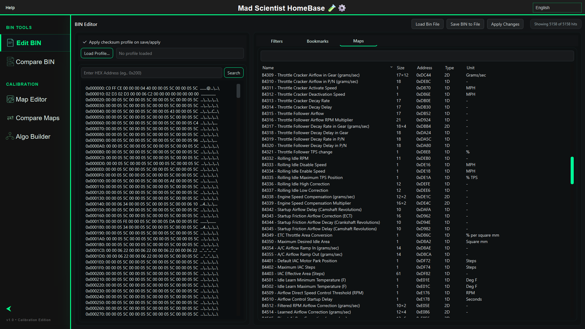
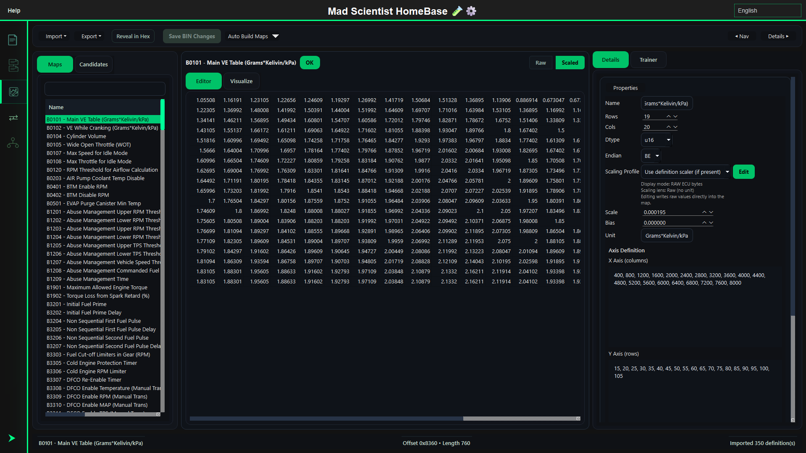
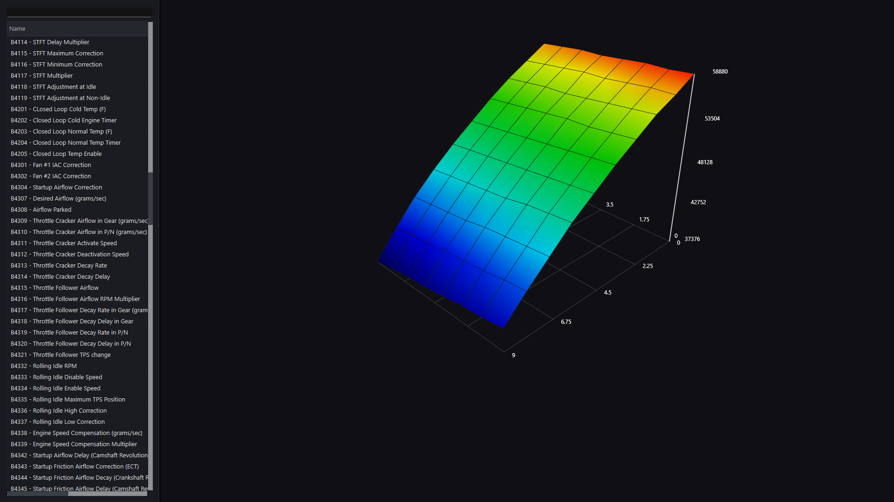
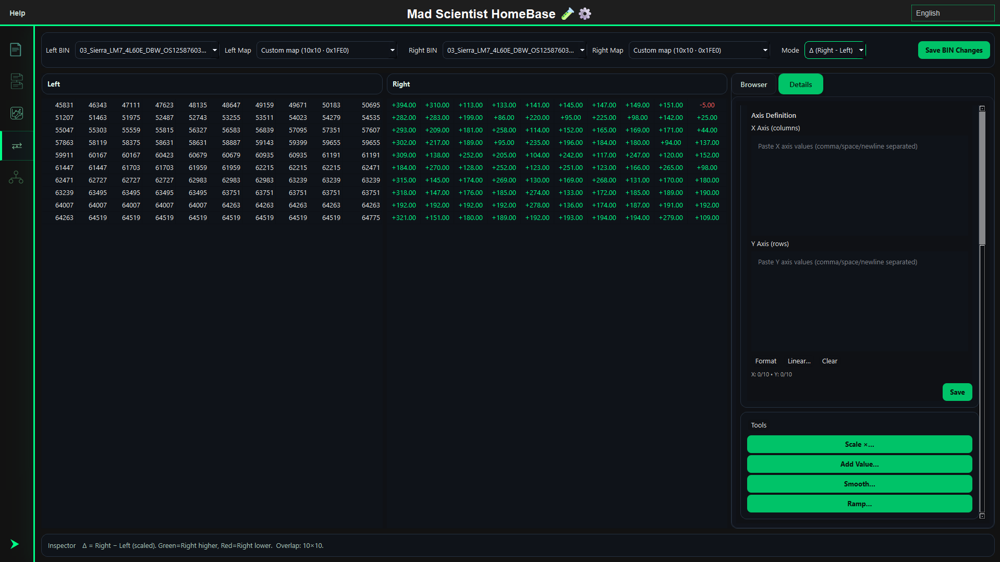
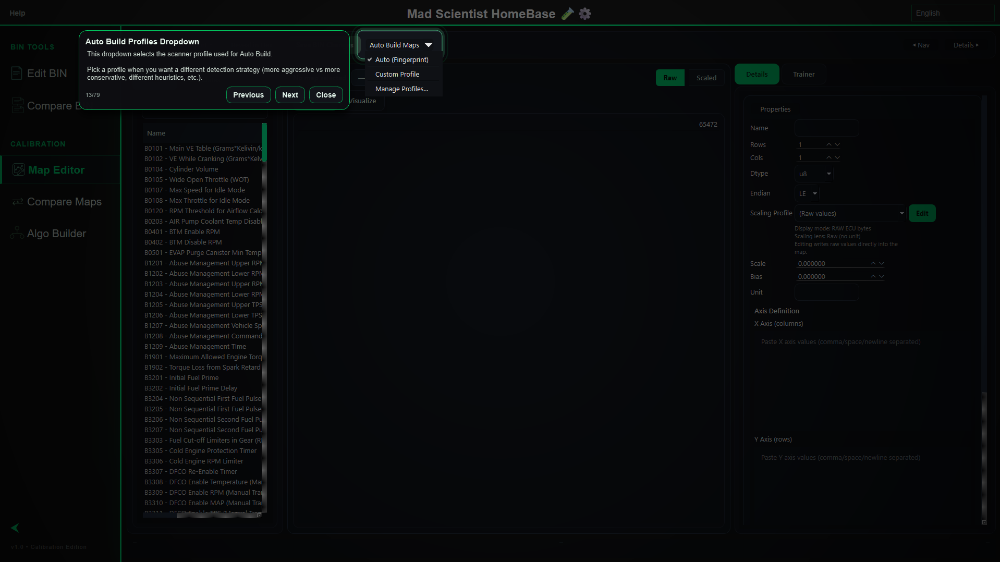

# MSHB

**MSHB** is a user-driven calibration editor and binary analysis platform built for exploring, visualizing, comparing, and organizing raw binary data without relying on preloaded manufacturer-specific content.

It is designed for users who want full control over their own calibration workflow: scanning unknown binaries, finding candidate maps, visualizing structures, applying custom scaling, comparing files, defining maps, and building reusable workflows offline.

---

## Demo

This demo shows the map scanner workflow going from raw scan results to a saved candidate map using reranking, 3D visualization, and custom scaling logic.

---

## Core Idea

MSHB is built around **user-driven workflows**.

Instead of depending on built-in manufacturer definitions, the goal is to give users tools to investigate raw binary data themselves:

- scan binaries for possible maps and structures
- compare files side by side
- visualize raw data patterns
- define and organize maps
- apply custom scaling
- build reusable checksum logic
- work fully offline

---

## Features

### Binary Analysis

- hex editor / binary reader
- raw data inspection
- structured binary workflows
- large-scale binary scanning

---

### Map Scanner

- heuristic-based candidate map detection
- automatic scanning for possible tables and structures
- candidate scoring
- user-trainable reranking system
- saved candidate workflows

---

### Visualization Tools

- 3D surface plots
- heatmaps
- histograms
- contour views
- visual inspection of raw/scaled data patterns

---

### Map Editing & Definitions

- map editing
- custom scaling formulas
- map saving and organization
- JSON map definition support
- XDF support

---

### Binary Compare / Map Compare

- compare two binaries side by side
- inspect differences
- compare map values
- copy/blend values between maps
- structured compare workflows

---

### Checksum System

- reusable checksum configurations
- built-in checksum logic
- custom Python checksum scripts
- user-defined checksum workflows

---

### Accessibility & Help

- translated into 25+ languages
- built-in guided walkthroughs
- interface help for learning the workflow

---

## Current Development Focus

MSHB is currently focused on improving:

- map scanning accuracy
- reranker training workflow
- visualization tools
- map definition workflows
- compare/blending tools
- checksum configuration
- overall user-driven calibration workflow

---

## Project Philosophy

MSHB is not designed around locked workflows or preloaded manufacturer-specific content.

The goal is to give users control over the raw data and provide tools that help them investigate, organize, visualize, and define their own calibration structures.

The workflow is meant to be:

- offline
- flexible
- extensible
- user-controlled
- built for investigation
- built for custom definitions

---

## Roadmap

Planned / ongoing work:

- improved reranker training
- better candidate filtering
- more visualization options
- more compare tools
- stronger map pack workflows
- expanded checksum templates
- better guided help
- more documentation and workflow examples

---

## Community

Discord coming soon.

For now, development updates, demos, and workflow notes will be posted here.
